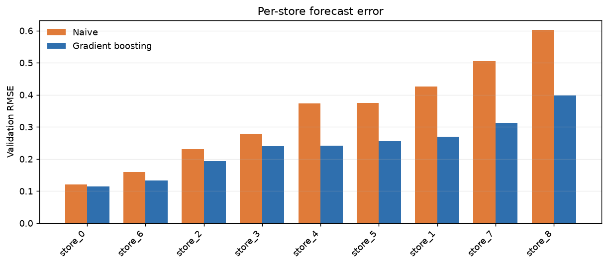
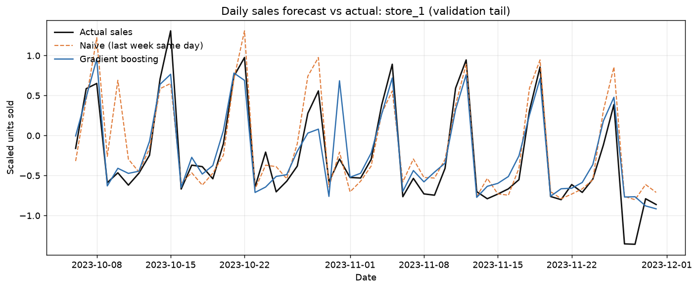
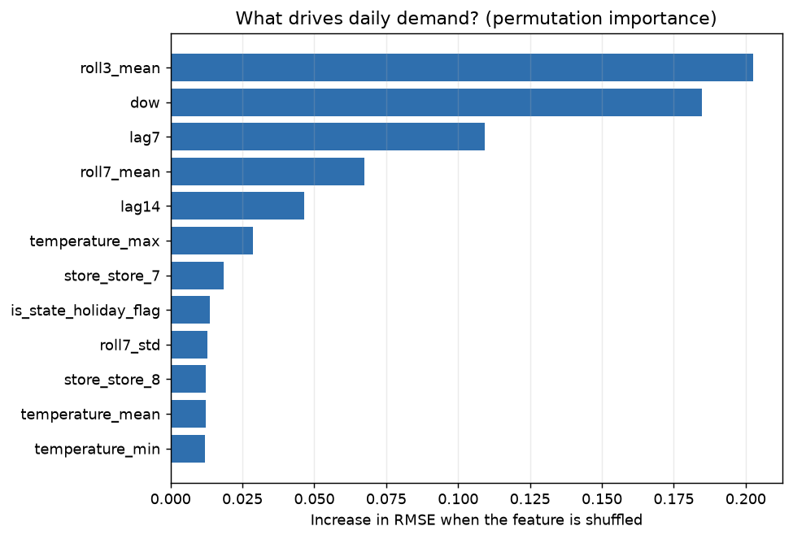
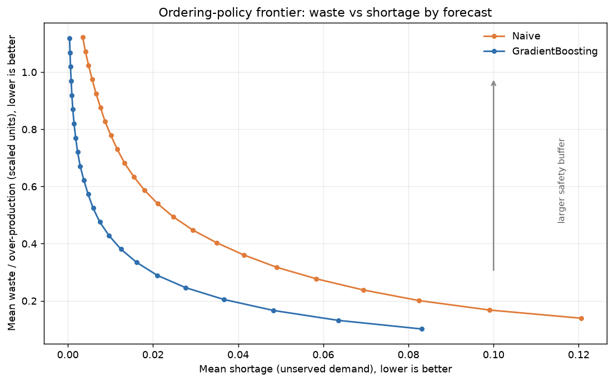

<div align="center">

# Demand Forecasting that Cuts Food Waste

**A bakery chain's make-or-break decision, quantified: forecast tomorrow's sales
so you bake the right amount and stop throwing away what didn't sell.**

</div>

## The problem

Pastry is a freshness business. Anything not sold by closing time is written
off, and that becomes food waste. A bakery that orders too much throws money
(and food) in the bin; one that orders too little loses revenue and disappoints
customers. The fix is a **better demand forecast**: bake close to what will
actually sell.

> Over-production is the food-waste lever. This project proves it from real
> data and shows a better forecast pulls that lever, cutting waste roughly 30%
> at the same customer-service level.

## The data

Daily sales for a German pastry chain (**Brammibals**, the Green-AI Hub /
[MIT-licensed dataset](https://github.com/Green-AI-Hub-Mittelstand/Reduce-Foodwaste-Dataset))
across **9 stores**, Aug 2021 – Nov 2023, with weather and public-holiday
features. For ~63% of store-days the chain also recorded how much it **ordered**
and how much went **unsold**.

| column | meaning |
|---|---|
| `date`, `store` | when & which of the 9 stores |
| `is_state_holiday`, `is_school_holiday`, `is_special_day` | day type |
| `temperature_max/min/mean`, `sunshine_sum`, `precipitation_sum` | weather |
| `sales` | **target**: total units sold (scaled per store for privacy) |
| `ordered`, `unsold` | units originally ordered / not sold (scaled; food-waste signal) |

> ⚠️ **Honest data note:** `sales`/`ordered`/`unsold` are anonymized and scaled
> per store, so results are reported in **relative terms** (error reduction and
> % change), not absolute item counts. The structural and relative findings are
> unaffected.

## What it shows

### 1 · Better forecast, at every store

A gradient-boosting model (sklearn `HistGradientBoostingRegressor`, no external
deps) is compared against a naive baseline ("same store, same day last week"),
on a **time-based holdout** (last 16 weeks) that mirrors a real production
decision: forecasting the future from the past.

| metric | Naive | Gradient boosting | Δ |
|---|---|---|---|
| Validation RMSE | 0.379 | **0.257** | **−32%** |
| Validation MAE | 0.260 | **0.185** | −29% |

The model beats naive at **all 9 stores**.




**What drives daily demand** (permutation importance): recent demand, day of
the week, the same weekday last week, and temperature. Demand is strongly
weekly and weather-sensitive.

> **Note on weather inputs:** the model uses the *forecast* day's weather
> (temperature, sunshine, precipitation) as features. In practice weather is
> known in advance from public forecasts, so this is realistic rather than
> leakage. There is a slight favorable edge over some baselines because the model
> sees the measured weather of the day it predicts, not just a forecast; in a
> production setting you would use the weather forecast for the target day.


### 2 · Over-production *is* the waste, and it's baked in

The data confirms the waste mechanism directly: `unsold` tracks `ordered − sales`
almost perfectly (**per-store correlation 0.999**), so `unsold` really is
over-production. And it is the norm rather than the exception: the chain
over-orders on **77% of operating days**.

### 3 · The payoff: ~30% less waste at the same service level

Final step is an **ordering-policy simulation**: "bake = forecast + safety
buffer", swept across buffer sizes on the validation days. It plots waste
(over-production) against shortage (unserved demand) for the naive vs the ML
forecast:



The ML policy is *Pareto-dominant*: for any given service level it over-produces
less. At a matched ~90% service level the ML forecast drives
**~35% less over-production** than the naive policy (≈32–35% across
85–95% service levels). Better forecasts mean you can order closer to real
demand: less food waste, less cost, fewer empty shelves.

## Reproduce it

```bash
python -m venv .venv && source .venv/bin/activate   # macOS/Linux
pip install -r requirements.txt

# 1) demand forecasting  ->  results/  (metrics + forecasts.csv + 3 plots)
python src/train_model.py

# 2) food-waste analysis ->  results/waste_* (frontier plot + policy table)
python src/waste_analysis.py
```

A walkthrough is also available as a [Jupyter notebook](notebooks/demand_forecasting_food_waste.ipynb).

## Project layout

```
data/       raw source files (see the Green-AI dataset above)
src/
  features.py        feature engineering (calendar, weather, lag demand)
  train_model.py     time-based backtest, naive vs gradient boosting
  waste_analysis.py  over-production analysis + ordering-policy simulation
notebooks/  step-by-step analysis
results/    metrics, forecasts, and plots
```

## About the author

Built to evidence hands-on demand-forecasting and operations experience for a
Food & Beverage analyst portfolio. Forecast accuracy ↔ inventory efficiency is
exactly the lever the author used to improve inventory efficiency and cut waste
across a multi-branch food-service operation. MIT licensed.
